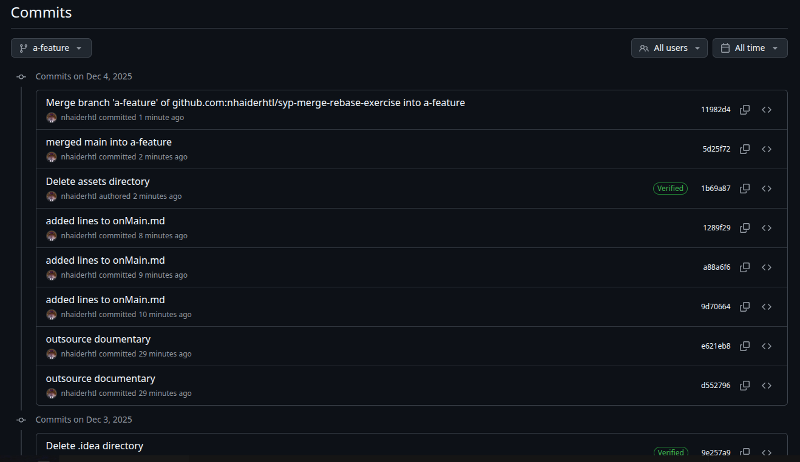
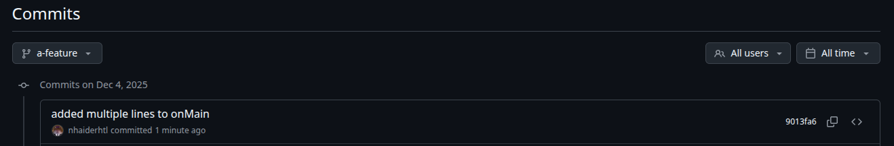

= SYP Rebase - Merge - Exercise Documentary

1. create a repository using *git init repo-name*  in the terminal, exchange repo-name with your desired repository name

2. use *cd repo-name* to switch into your repository folder
3. *touch onMain.md* to create the file and commit using *git add .* to add the file then *git commit -m "initial commit"* to make the first commit
4. *git checkout -b a-feature* to create and checkout the feature branch
5. *touch onBranch.md* to create the next file
6. use *nano onBranch.md* and write some lines in the file.
When finishing press *CTRL + S && CTRL + X*
then commit the changes using *git add .* and *git commit -m "commit-message" and replace commit-message with your desired message*
7. use *git push* to make your changes available remotely, then go to your repo on the github website and click on the history which shows your recent commits:
* History on branch: image:assets/history.png[]
8. then back in the terminal *git checkout main* to go back to the main branch and then check the History and content on main as before:
* history:image:assets/history-main.png[]
* content:image:assets/content-main.png[]
9. there are a few differences now, e.g. the file onBranch.md is missing in main branch, but the inital commit that happened on main is on the branch as the branch was created after that commit.
10. now add some lines to onMain.md using *nano onMain.md* and then save and exit as before.
Then commit the changes just like we did before.
11. repeat step 10 two more times.
After that use *git push* again.
12. document the history like before: image:assets/history-main-2.png[]
13. use *git checkout a-feature* to switch back to the feature branch and then use *git merge main* to merge the changes from main into the feature branch.
14. document the history again: 
* now the feature branch has all the commits from main as well as its own commits.
15. now repeat all the steps in a new repository but instead of using *git merge main* use *git rebase main* in step 13.
16. document the history again: 
* now the feature branch has all the commits from main as well as its own commits, but not because they were merged, but because the commits from the feature branch were reapplied on top of the main branch commits.
17. compare the histories of the merge and rebase repositories.
* In the merge repository the history shows a merge commit that combines the histories of both branches.
* In the rebase repository the history is linear, as if the commits from the feature branch were made after the commits from the main branch.
